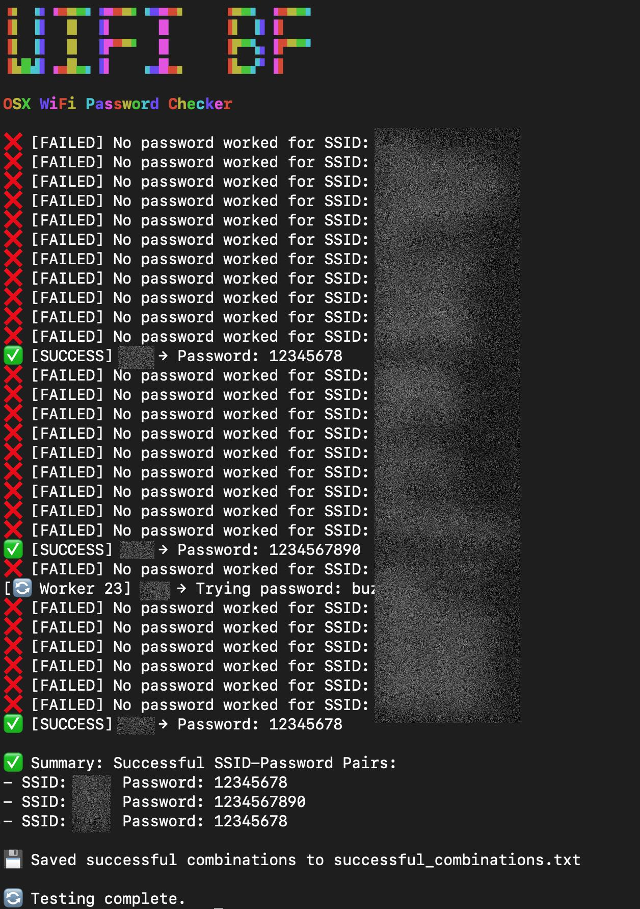

# THIS DOES NOT WORK

# WifiBF
 OSX Wifi password checker using OSX built-in tools (+ Python 3 that is sadly not supplied by default anymore).
 

### Disclaimer
* This is a coding exercise, for educational purposes only.
* Only use this in a controlled environment, on hardware you own (harder than you think). 

### Operation
This script uses OSX built-in command-line tools (sans Python 3) to scan and connect to SSIDS in scanning range using a list of example passwords you can find in the script. Optionally you can adjust the script to use an external text file (see code). 

### Usage
You might need to install the OSX command-line tools, you can invoke this by simply typing the following in the Terminal:
 
> python3
 
After python3 is installed you can simply run this script like:

> python wifibf-single-thread.py

Example output:

### Notes/Limitations/Bugs/Issues
* This script omits open networks.
* Known networks accept any password that is thrown at them (false positives). 
* You might get a pop-up asking for your admin pass, to make changes to the network settings when a match is found...I do not know how to get around this.
* The single thread version is confirmed to be working in a isolated test setting on self-owned hardware. The multithread version is not working at the moment, see below:
* The 'wifibf.py' script is ai generated crap that doesn't work, it was an attempt at multi-threading but that might be impossible considering the hardware involved (1 interface).
* There are some quality of life improvements in 'wifibf.py' that should be implemented in the single thread version (like showing names of Access Points around).
